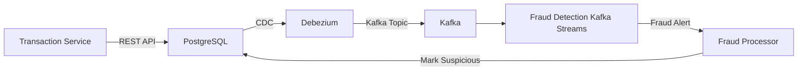
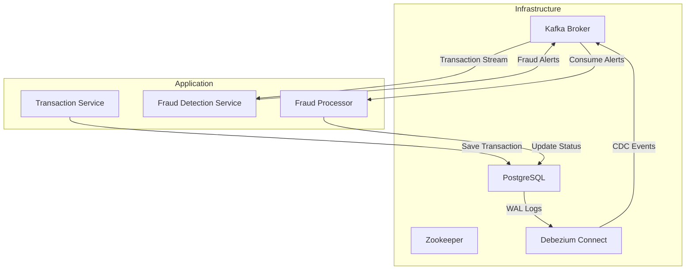

# Fraud Detection - Real-time Transaction Monitoring


### Профессиональная система для обнаружения мошеннических транзакций в реальном времени с использованием:

- Kafka Streams для обработки потоковых данных
- Debezium для CDC (Change Data Capture)
- PostgreSQL как основного хранилища данных
- Spring Boot как бэкенд-фреймворка

---
### Схема работы



---

> ### ⚠️ ВАЖНОЕ ПРИМЕЧАНИЕ ПО БЕЗОПАСНОСТИ
> **SSL/TLS сертификаты не включены в публичный репозиторий** в целях безопасности.  
> Для настройки защищенного соединения следуйте инструкциям в разделах:  
> [Конфигурация безопасности](#конфигурация-безопасности).

---


## Структура проекта

```
fraud-detection/
├── src/
│   ├── main/
│   │   ├── java/com/
│   │   │   ├── config/           # Конфигурация Kafka
│   │   │   ├── controller/       # REST контроллеры
│   │   │   ├── detection/        # Главный класс приложения
│   │   │   ├── model/            # Сущности данных
│   │   │   ├── repository/       # Репозитории Spring Data
│   │   │   └── service/          # Бизнес-логика и Kafka Streams
│   │   └── resources/
│   │       ├── ssl/              # SSL сертификаты (не включены в репозиторий)
│   │       ├── application.properties
│   │       └── logback-spring.xml
├── docker-compose.yml            # Docker инфраструктура
├── register-connector.sh         # Скрипт настройки Debezium
├── pom.xml                       # Maven зависимости
└── README.md                     # Документация
```

---

## Технологический стек

- Java 17
- Spring Boot 3.1.0
- Apache Kafka 3.5.1
- Kafka Streams
- Debezium 2.3
- PostgreSQL 13
- Docker 20.10+
- Maven 3.8+


### Архитектура решения


---
## Требования к окружению
Минимальные системные требования

- CPU: 4 ядра
- RAM: 8 GB
- Disk: 20 GB свободного пространства
- OS: Linux/macOS/Windows (с WSL2)

### Необходимое ПО
- Docker 20.10.0+
- Docker Compose 1.29.0+
- Java JDK 17+
- Maven 3.8+
- Git 2.30+

---
## Развертывание системы
1. Клонирование репозитория

```bash
git clone https://github.com/your-repo/fraud-detection-system.git
cd fraud-detection-system
```

2. Запуск инфраструктуры
```bash
docker-compose up -d
```

3. Регистрация Debezium Connector
```bash
chmod +x register-connector.sh
./register-connector.sh
```

4. Сборка и запуск приложения
```bash
mvn clean package
java -jar target/fraud-detection-1.0.0.jar
```

5. Проверка работоспособности
```bash
curl -X POST http://localhost:8080/transactions \
  -H "Content-Type: application/json" \
  -d '{"amount": 150.0, "currency": "USD", "userId": 123}'
``` 


### Добавление настроек SSL для Spring Boot приложение:

```
# application.properties
spring.kafka.properties.security.protocol=SSL
spring.kafka.ssl.trust-store-location=classpath:ssl/kafka.client.truststore.jks
spring.kafka.ssl.trust-store-password=changeit
```
---
## Тестирование системы
### 1. Генерация тестовых транзакций

```
# Генерируем 3 транзакции для одного пользователя
for i in {1..3}; do
  curl -X POST http://localhost:8080/transactions \
    -d "{\"amount\": $((100 * $i)), \"currency\": \"USD\", \"userId\": 1001}"
done
```
### 2. Мониторинг алертов

```bash
# Просмотр алертов в Kafka
docker exec -it kafka kafka-console-consumer \
  --bootstrap-server localhost:9093 \
  --topic fraud-alerts \
  --from-beginning  
```

### 3. Проверка статуса транзакций

```
# SQL
SELECT user_id, status, COUNT(*) 
FROM transaction 
GROUP BY user_id, status;
```
---
## Мониторинг и отладка
### Доступные интерфейсы:
- Debezium Connect: http://localhost:8083/connectors
- PostgreSQL: psql -h localhost -U springuser transactions_db

---
## Оптимизация производительности
### Настройки Kafka Streams
```
# application.properties
spring.kafka.streams.properties.num.stream.threads=4
spring.kafka.streams.properties.commit.interval.ms=1000
spring.kafka.streams.properties.cache.max.bytes.buffering=10485760
```

### Параметры Docker
```
# docker-compose.yml
kafka:
  environment:
    KAFKA_HEAP_OPTS: "-Xmx2G -Xms2G"
    KAFKA_JVM_PERFORMANCE_OPTS: "-XX:MetaspaceSize=96m"
```


---

## Конфигурация безопасности

### 1. Создайте SSL сертификаты в директории docker/ssl (в корне проекта):

```bash
# Генерация CA
openssl req -new -x509 -keyout ca.key -out ca.crt -days 365 -subj "/CN=Kafka-CA" -passout pass:changeit

# Генерация сертификата для Kafka
keytool -keystore kafka.jks -alias kafka -validity 365 -genkey -keyalg RSA -storepass changeit -keypass changeit -dname "CN=kafka"

# Создание CSR
keytool -keystore kafka.jks -alias kafka -certreq -file cert-file -storepass changeit

# Подпись сертификата
openssl x509 -req -CA ca.crt -CAkey ca.key -in cert-file -out cert-signed -days 365 -CAcreateserial -passin pass:changeit

# Импорт CA и сертификата в хранилище
keytool -keystore kafka.jks -alias CARoot -import -file ca.crt -storepass changeit -noprompt
keytool -keystore kafka.jks -alias kafka -import -file cert-signed -storepass changeit

# Создание truststore
keytool -keystore truststore.jks -alias CARoot -import -file ca.crt -storepass changeit -noprompt
```

### 2. Обновите конфигурацию Docker:

```bash
# docker-compose.yml
kafka:
  environment:
    KAFKA_LISTENER_SECURITY_PROTOCOL_MAP: INTERNAL:SSL, EXTERNAL:SSL
    KAFKA_SSL_KEYSTORE_FILENAME: kafka.server.keystore.jks
    KAFKA_SSL_KEYSTORE_CREDENTIALS: ssl_creds
    KAFKA_SSL_KEY_CREDENTIALS: ssl_creds
  volumes:
    - ./ssl:/etc/kafka/secrets
```

### 3. Настройте Spring Boot приложение:
```bash
# application.properties
spring.kafka.properties.security.protocol=SSL
spring.kafka.ssl.trust-store-location=classpath:ssl/kafka.client.truststore.jks
spring.kafka.ssl.trust-store-password=changeit
```


### Запуск приложения

```bash
# Запуск контейнеров
docker-compose up -d

# Запускаем скрипт в bash 
./register-connector.sh

# Далее запускаем Spring Boot приложение в классе FraudDetectionApplication

# Удаление контейнеров
docker-compose down -v --remove-orphans
```

### Если необходима полная перезагрузка:

```bash
docker-compose down -v --remove-orphans
docker system prune -a -f
docker-compose up -d
````

---
## Тестирование работы:

 - Отправка тестовых транзакций
 ```bash
curl -X POST http://localhost:8080/transactions -H "Content-Type: application/json" -d '{
"amount": 1500.00,
"currency": "USD",
"userId": 12345
}'

# Проверка логов Kafka Streams
docker-compose logs kafka | grep "Fraud detected"
 ```

### Подключится напрямую к контейнеру:

```bash
docker exec -it postgres psql -U postgres -d transactions_db
```
---
## Оптимизация производительности
### Настройки Kafka Streams

```
# application.properties
spring.kafka.streams.properties.num.stream.threads=4
spring.kafka.streams.properties.commit.interval.ms=1000
spring.kafka.streams.properties.cache.max.bytes.buffering=10485760
```

### Параметры Docker
```
# docker-compose.yml
kafka:
  environment:
    KAFKA_HEAP_OPTS: "-Xmx2G -Xms2G"
    KAFKA_JVM_PERFORMANCE_OPTS: "-XX:MetaspaceSize=96m"
```
---
## 📜 Лицензия
© 2025. Данный проект распространяется под лицензией [MIT License](https://choosealicense.com/licenses/mit/).
